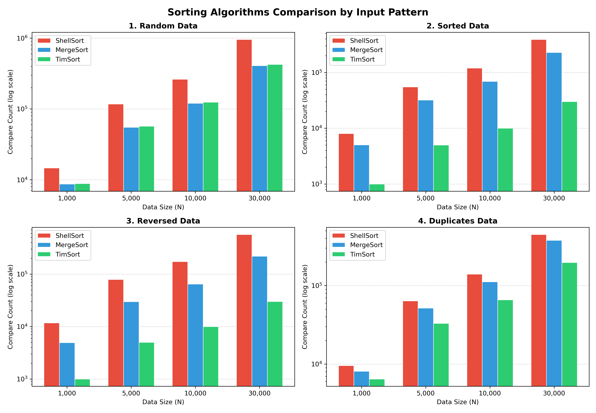

# 정렬 알고리즘 비교 실험: ShellSort · MergeSort · TimSort

> 이미지 `sort_comparison_graph.png`는 이 파일과 같은 폴더에 둬야 합니다! (`plot.py` 실행 결과물)

---

## 1. 정렬 알고리즘 3가지

수업에서 배운 정렬 중 나에게 생소했던 정렬을 고르다가, 실무에서 가장 많이 쓰인다고 들은 **TimSort**를 안 배운 정렬로 고르기로 했다. (Python, java 등에서 널리 사용되는 정렬이라고 한다.) 비교 대상은 다음 세 가지다.

| 알고리즘 | 선정 이유 |
|---|---|
| **ShellSort** | 삽입 정렬을 개선한 제자리(in-place) 정렬. 안정하지 않다고 알려져 있어 안정성 비교의 대조군이 된다. |
| **MergeSort** | 입력 모양에 상관없이 O(n log n)이 보장되는 기준선(baseline). TimSort의 뼈대이기도 하다. |
| **TimSort** | 병합 정렬 + 삽입 정렬 + 이미 정렬된 구간(run)을 활용하는 실무형 정렬 |

**핵심 질문:** TimSort는 정말로 "입력이 어떻게 생겼든" 다른 정렬보다 좋은가? 그 대가(메모리 등)는 무엇인가?

---

## 2. 어떻게 비교할 것인가

시간만 재면 컴퓨터 상태에 따라 달라질 수 있으므로, **기계와 무관한 지표**(비교횟수, 이동횟수)를 함께 기록했다.

| 지표 | 측정 방법 | 의미 |
|---|---|---|
| 비교 횟수 (`CompareCount`) | 모든 키 비교를 `compare_records()` 한 곳으로 통과시켜 카운트 | 알고리즘 자체의 일량 |
| 이동 횟수 (`MoveCount`) | 모든 레코드 대입을 `move_record()` 한 곳으로 통과시켜 카운트 | 메모리 쓰기량 |
| 실행 시간 (`TimeMS`) | `clock()`으로 정렬 구간만 측정 | 실제 체감 속도 |
| 보조 메모리 (`AuxBytes`) | 정렬이 추가로 잡는 버퍼 크기 | 공간 비용 |
| 안정성 (`IsStable`) | 아래 3절 참고 | 같은 값을 가진 원소들의 원래 순서 보존 여부 |

**입력 조건**

- 입력 패턴 4가지: **무작위(Random) · 정렬됨(Sorted) · 역순(Reversed) · 중복 많음(Duplicates)**
- 입력 크기 N: 1,000 / 5,000 / 10,000 / 30,000
- 모든 알고리즘은 **완전히 같은 입력**(원본을 `memcpy`로 복사)을 받는다. 난수 시드는 `srand(42)`로 고정했다.
- 무작위: 키 범위 `0 ~ 10N-1` / 중복 많음: 키가 `0~4` 다섯 가지뿐 / 정렬됨: `0,1,2,…` / 역순: `N, N-1, …, 1`

---

## 3. 구현

### 3.1 레코드와 카운터

정수 배열로는 안정성을 볼 수 없다. `3`과 `3`은 구별되지 않기 때문이다. 그래서 원소를 **두 칸짜리 구조체**로 만들었다.

```c
typedef struct {
    int key;             // 정렬 기준
    int original_index;  // 입력에서의 원래 위치 (꼬리표)
} Record;
```

비교 함수는 **값(key)만** 보고 정렬을 진행한다. 렬이 끝난 뒤에는 **같은 값**끼리 original_index를 보고 오름차순이면 안정 정렬로 판단한다.

```c
static int is_stable(const Record arr[], int n) {
    for (int i = 1; i < n; i++)
        if (arr[i-1].key == arr[i].key &&
            arr[i-1].original_index > arr[i].original_index) return 0;
    return 1;
}
```

비교와 이동을 각각 `compare_records()`, `move_record()` 에서만 세도록(비교함수 1번 호출 --> 비교 1회) 해서, 서로 다른 세 알고리즘이 **같은 기준**으로 집계되게 했다.

### 3.2 구현 검증

구현이 틀렸는데 그래프에서는 정상으로 보여 잘못 판단하는 일을 막기 위해, 실험 전에 알고리즘 중 가장 복잡했던 timsort를 `validate_tim_sort()`로 검증했다.

- N = 0 ~ 1024 **전부**에 대해
- 4가지 패턴(오름차순 / 내림차순 / 중복 많은 패턴 / 의사 난수)을 넣고
- 결과가 **정렬되어 있는지**, **안정한지** 매번 확인

하나라도 실패하면 프로그램이 벤치마크(실행) 전에 종료된다. N=0~1024를 모두 돌리는 이유는 TimSort의 분기(`MIN_MERGE=32` 미만은 삽입 정렬만, 그 이상은 run 병합)가 N 구간마다 다르게 동작하기 때문이다. 벤치마크(실행) 단계에서는 각 결과의 안정성도 기록한다.

---

## 4. 각 알고리즘 원리, 특징

### 4.1 ShellSort

**원리:** 멀리 떨어진 원소끼리 먼저 삽입 정렬(간격 `gap`)하고, 간격을 절반씩 줄여 마지막에 `gap=1`(일반 삽입 정렬)로 마무리한다. 큰 간격에서 이미 대강 정렬되어 있으므로 마지막 삽입 정렬이 빨라진다.

**성질:** 멀리 떨어진 원소를 건너뛰며 교환하기 때문에 같은 키의 순서가 뒤집힐 수 있다. → **불안정**

### 4.2 MergeSort

**원리:** 배열을 반으로 나눠 각각 정렬한 뒤, 두 정렬된 절반을 **앞에서부터 하나씩 비교하며** 합친다. 동일 키일 때 왼쪽을 먼저 내보내면(`<= 0`) 순서가 보존된다.

**성질:** 입력이 어떻게 생겼든 항상 같은 모양의 분할·병합을 한다. → **입력에 둔감, 안정**

### 4.3 TimSort

**원리:** "현실의 데이터는 이미 부분적으로 정렬되어 있는 경우가 많다"는 관찰에서 출발한다.

1. **자연 run 탐지:** 이미 정렬된 구간을 찾는다. 내림차순이면 제자리에서 뒤집는다. (`count_run_and_make_ascending`)
2. **최소 run 길이** run이 `minrun`(32~64)보다 짧으면 **이진 삽입 정렬**로 길이를 채운다.
3. **run 스택 병합:** 스택에 run들을 쌓는다. 특정한 규칙(`runs[n-1] > runs[n] + runs[n+1]` 등)에 따라 병합을 하도록 해서 효율적으로 하도록 한다.(run 크기가 비슷한 자료들끼리 병합 하도록 하는 규칙에 의해, 극단적으로 크기가 다른 run끼리의 병합이 최대한 덜 일어나도록 한다.)
4. **병합 전 검사:** 왼쪽 run의 마지막 ≤ 오른쪽 run의 첫 원소이면 병합 자체를 생략한다.
5. **Galloping:** Galloping mode는 3번 스택 병합 과정의 속도를 더욱 빠르게 해준다. 한쪽 run이 `MIN_GALLOP=7`번 연속으로 이기면, 한 칸씩 비교하는 대신 이진 탐색(`lower_bound`/`upper_bound`)으로 한 번에 뭉텅이를 넘긴다.

**성질:** 이미 정렬된 구간이 길수록 일이 줄어든다. 동일 키의 상대 순서를 지키도록 구현했다. → **안정**

---

## 5. 실험 결과

### 5.1 비교 횟수 그래프 ( 환경의 영향을 받지 않는 비교 횟수를 대표로 그래프를 그렸다.)



> ⚠️ **세로축이 로그 스케일이다.** 눈금 한 칸(10배)이 같은 높이로 그려지므로, **막대 높이 차이보다 실제 차이가 훨씬 크다.** 예를 들어 정렬됨 N=30,000에서 MergeSort(227,728)와 TimSort(29,999)는 그래프에서 "절반쯤 작은 것"처럼 보이지만 실제로는 **약 7.6배** 차이다.

### 5.2 N = 30,000 요약 (전체 수치는 `results.csv`)

**비교 횟수**

| 패턴 | ShellSort | MergeSort | TimSort |
|---|---:|---:|---:|
| Random | 955,510 | **408,476** | 425,316 |
| Sorted | 390,007 | 227,728 | **29,999** |
| Reversed | 567,016 | 219,504 | **29,999** |
| Duplicates | 447,656 | 378,505 | **197,068** |

**실행 시간 (ms)**

| 패턴 | ShellSort | MergeSort | TimSort |
|---|---:|---:|---:|
| Random | 3.841 | **2.692** | 3.251 |
| Sorted | 0.748 | 0.801 | **0.028** |
| Reversed | 0.954 | 0.781 | **0.034** |
| Duplicates | 1.358 | 1.471 | **1.269** |

**이동 횟수**

| 패턴 | ShellSort | MergeSort | TimSort |
|---|---:|---:|---:|
| Random | 1,360,855 | 894,464 | **718,836** |
| Sorted | 780,014 | 894,464 | **0** |
| Reversed | 987,006 | 894,464 | **45,000** |
| Duplicates | 847,792 | 894,464 | **647,866** |

---

## 6. 결과 해석: 왜 이런 모양이 나왔나

### 6.1 입력 모양을 타는가, 안 타는가

- **MergeSort는 입력 모양을 거의 타지 않는다.** 이동 횟수는 패턴과 무관하게 N=30,000에서 **항상 894,464**로 완전히 같다. 분할·병합 구조가 입력 값과 무관하게 고정이기 때문이다. 비교 횟수만 조금 변한다(219,504~408,476). 병합 중 한쪽이 먼저 바닥나면 나머지를 비교 없이 복사하기 때문인데, 정렬됨/역순에서는 한쪽이 통째로 먼저 소진되어 비교가 약 절반으로 준다. 이는 최악을 감당해야 하는 코드가 원하는 성질이다.
- **ShellSort는 입력 모양에 따라 들쭉날쭉하다.** 무작위(955,510)가 정렬됨(390,007)보다 **약 2.4배** 많다. 정렬됨이어도 각 간격마다 "이미 맞는지 확인하는 비교"를 전 원소에 대해 해야 하므로(간격 수 ≈ log₂N개 × N개) 0이 되지 않는다. 즉 정렬됨에서도 N log N에 가까운 일을 한다.
- **TimSort는 입력 모양에 가장 민감하고, 그 민감함이 강점이다.** 정렬됨이면 run 탐지 단계에서 N-1번 비교로 전체가 run 하나로 잡히고 끝난다. 이동은 0번이다. 역순이면 run 하나를 뒤집기만 하면 된다(이동 1.5N = 45,000: 뒤집기 교환 N/2번 × 3회 이동). 이런 패턴은 TimSort 설계가 노리는 바로 그 "현실의 부분 정렬 데이터"다.

### 6.2 무작위 입력에서는 TimSort가 이기지 못한다

무작위에서는 자연 run이 거의 없으므로 TimSort의 이점이 사라지고, MergeSort와 **비교 횟수는 비슷하며(TimSort가 약 4% 더 많음)** 시간은 오히려 **TimSort가 약 20% 느리다**(3.251 vs 2.692ms). run 탐지·이진 삽입 정렬·galloping 모드 판단 같은 **부가 작업의 오버헤드**가 이득 없이 비용만 더하기 때문이다. TimSort는 "무작위에서 더 빠르다"가 아니라 "무작위에서 크게 손해 보지 않으면서, 구조가 있는 데이터에서 크게 이긴다"는 전략이다. (이동 횟수는 TimSort가 더 적은데도 시간이 더 걸렸다. 이동 횟수만으로는 실제 시간을 설명할 수 없다는 뜻이다.)

### 6.3 중복이 많을 때

키가 5종류뿐이라 같은 값이 길게 이어진다. 병합 중 한쪽이 연속으로 이기는 상황이 많아져 **galloping이 자주 발동**하고, TimSort의 비교 횟수가 MergeSort의 약 절반(197,068 vs 378,505)으로 줄었다. 시간 차이는 작았다(1.269 vs 1.471ms). 비교 횟수 차이가 그대로 시간 차이가 되지는 않는다.

---

## 7. 복잡도 지수: N이 커질 때 비교 횟수의 기울기

N을 키울 때 비교 횟수 곡선의 기울기는 복잡도의 지수 역할을 한다. 로그-로그 그래프에서 `CompareCount ∝ N^k`로 놓고 N=1,000~30,000의 네 점을 직선 피팅한 기울기 `k`는 다음과 같다.

| 패턴 | ShellSort | MergeSort | TimSort |
|---|---:|---:|---:|
| Random | 1.23 | 1.13 | 1.14 |
| Sorted | 1.15 | 1.12 | **1.00** |
| Reversed | 1.14 | 1.12 | **1.00** |
| Duplicates | 1.13 | 1.13 | 1.01 |

- N log N 알고리즘은 이 구간에서 `k ≈ 1.1~1.15`로 나온다. (log N 인자가 지수를 조금 끌어올리기 때문이다.) MergeSort는 패턴과 무관하게 이 값에 머문다.
- TimSort가 정렬됨/역순에서 **정확히 `k = 1.00`**이다. 비교 횟수가 N-1로 N에 **선형**으로 늘어난다는 뜻이다.
- ShellSort의 무작위 `k = 1.23`은 N log N보다 가파르다. 간격 수열 `n/2, n/4, …`가 최악에서 N²에 가까워질 수 있는 Shell 원안임을 반영한다. 다만 측정 구간이 좁아(30배) 지수를 단정하기는 어렵다.

---

## 8. 최적(Best case)에 대한 분석

MergeSort는 최선의 경우에도 비교·이동 횟수를 크게 줄이지 못한다. 분할과 병합을 입력과 무관하게 전부 수행해야 하기 때문이다. 이동 횟수는 최선이든 최악이든 894,464로 동일하다.

반면 TimSort는 **최선이 N-1번 비교(선형)로 N log N을 따라가지 않는다.** 정렬됨 입력에서 N=30,000일 때 비교 29,999번, 이동 0번이다. 그 결과 시간도 0.028ms로 나머지의 약 27~29배 빠르다. 이것이 TimSort를 "적응형(adaptive) 정렬"이라 부르는 이유이며, 실무에서 "이미 거의 정렬된 데이터에 새 데이터를 덧붙인 뒤 다시 정렬"하는 경우가 흔하다는 점과 맞닿아 있다.

---

## 9. 메모리와 안정성

| | ShellSort | MergeSort | TimSort |
|---|---|---|---|
| 보조 메모리 | **8 B** (임시 `Record` 1개, O(1)) | N×8 B (N=30,000일 때 **240,000 B**) | N×8 B (N=30,000일 때 **240,000 B**)† |
| 안정성 | ❌ 불안정 | ✅ 안정 | ✅ 안정 |

† 이 구현은 편의상 길이 N짜리 임시 배열을 잡았다. 실제 병합은 **더 짧은 쪽 run**만 복사하므로 이론적으로는 최대 N/2까지로 줄일 수 있다. 여기에 run 스택(최대 85개 × 8 B = 680 B)이 추가로 필요하나 집계에는 포함하지 않았다.

**결론적으로 안정성과 속도를 얻는 대가는 메모리다.** ShellSort만 메모리를 거의 쓰지 않지만, 그 대가로 안정성을 잃는다. 실험에서도 무작위(Random)와 중복 많음(Duplicates) 입력에서 ShellSort만 `Unstable`로 기록되었다.

---

## 10. 실험의 한계

1. **시간 측정의 신뢰도.** `clock()`을 **알고리즘당 1회만** 측정했고, 가장 작은 경우는 0.002ms 수준이라 측정 해상도와 가깝다. 반복 측정 후 평균·분산을 내지 못했다. 그래서 그래프는 (노이즈가 없는) **비교 횟수**를 중심으로 그렸고, 시간은 보조 근거로만 읽었다.
2. **랜덤성** 무작위·중복 입력은 시드 하나(42)로 한 번만 생성했다. 다른 무작위 입력에서는 어떤 결과가 나올 지는 모른다. 하지만 여러번 실험을 해봤을때도 크게 다르지 않은 결과가 나왔다..
4. **입력 패턴의 폭.** "거의 정렬됨(일부만 섞인 데이터)", "정렬된 run 여러 개를 이어 붙인 데이터"처럼 TimSort가 특히 유리한 현실적 패턴은 실험하지 못했다.
5. **TimSort 구현의 차이.** 직접 구현한 TimSort는 Python/Java 표준 구현과 세부(최소 run 길이, galloping 임계값 동적 조정, 임시 버퍼 크기)가 다르다. 표준 구현의 수치와 직접 비교할 수는 없다.
6. **비교 횟수 집계 범위.** galloping의 이진 탐색과 이진 삽입 정렬의 비교도 모두 `CompareCount`에 포함했다. 이는 공정한 집계이지만, "한 번의 비교 비용"은 알고리즘마다 캐시 접근 패턴이 달라 동일하지 않을 수 있다.
7. **검증 범위.** 구현 검증(`validate_tim_sort`)은 TimSort에만 적용했다. ShellSort와 MergeSort는 벤치마크 결과의 `IsStable` 외에 별도 정렬 정확성 검사를 하지 않았다.

---

## 11. 결론

- **입력이 어떻게 생겼는지 모를 때 가장 무난한 것은 MergeSort**다. 입력 모양에 거의 영향을 받지 않고 안정하다. 무작위 입력에서는 TimSort보다 조금 더 빨랐다.
- **TimSort는 구조가 있는 데이터에서 압도적이다.** 정렬됨/역순에서 비교 횟수가 N-1로 선형이고 시간이 MergeSort의 **약 23~29배** 빠르다. 중복이 많을 때도 비교 횟수가 약 절반이다. 무작위에서는 오버헤드(의미가 없는 추가 연산.) 때문에 약간 손해다. 그래서 "무작위에서 빠르다"가 아니라 **"평소엔 비슷하고, 현실의 데이터에서 크게 이기는" 정렬**이다.
- **ShellSort는 메모리가 거의 안 드는 대신 불안정하고 느리다.** 메모리가 극도로 제한되고 안정성이 필요 없을 때만 의미가 있다.
- **안정성과 속도의 대가는 O(N) 메모리**다. 이 실험에서는 N=30,000일 때 240KB였다.
